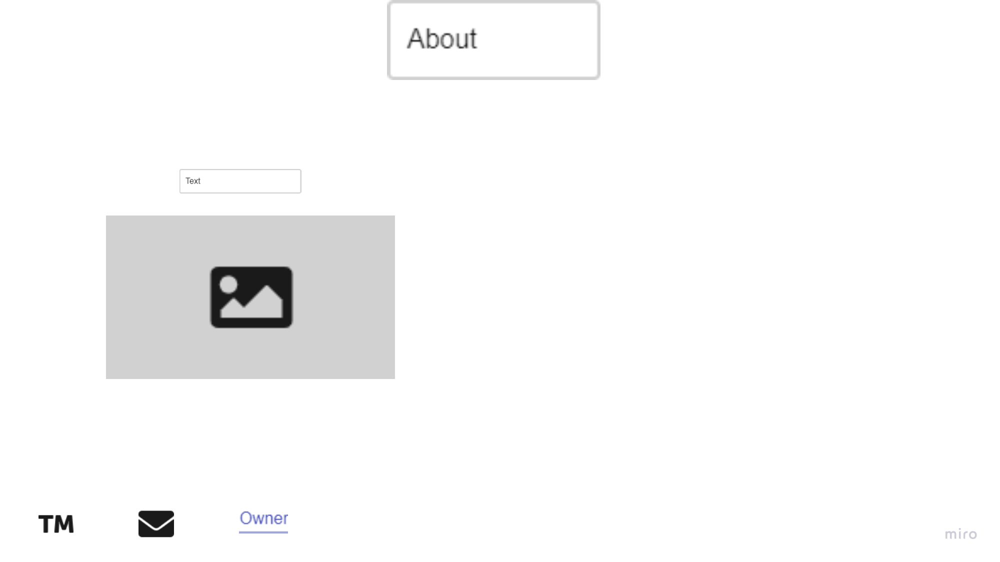

# my-restaurant

*Welcome to **Vegans Restaurant***

## **Vegans Restaurant**
Your choice for healthier life

## **Dishes**
Here, you can find everything healthy, cheap and valuable.

## **Menu**
1. Green Bean Salad
2. Crunchy Ribon Salad
3. Quinoa Lentil Salad

wireframe
**added wireframe**

-------------------
my-restaurant-style

More to know about vegan diet [click here](https://www.rush.edu/news/health-benefits-vegan-diet)

------------

OBSERVATIONS:
-I think one lecture for CSS is not enough. I need to practise it well i Eid holiday
-Many parts need from us many trials until they work

TIME:
-I thought It would take an hour
-It took two hours
